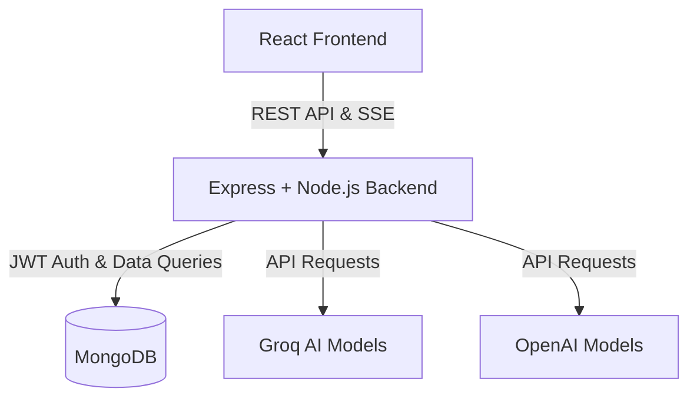
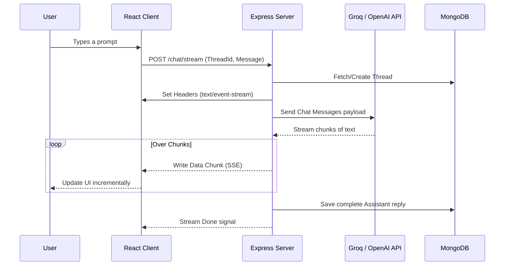

<h1 align="center">
  NeuraChat 🤖
</h1>

<p align="center">
  <strong>A MERN-based ChatGPT replica implemented from scratch using OpenAI and Groq APIs.</strong>
</p>

<p align="center">
  
  
  
  
  
</p>

---

## 📖 Project Overview

**NeuraChat** is a highly responsive, full-stack chatbot application designed to replicate the core experience of ChatGPT. Built using the **MERN** stack (MongoDB, Express, React, Node.js), it integrates seamlessly with modern AI models through **Groq**, **OpenAI**, and **Google GenAI** SDKs. The app implements **Server-Sent Events (SSE)** to provide real-time, streaming text generation, offering a smooth and intuitive user experience.

## ✨ Key Features

- **Real-Time Streaming Responses**: Implements Server-Sent Events (SSE) for word-by-word streaming of AI responses, reducing perceived latency.
- **Thread Management**: Users can create, view, rename, and delete conversation threads, just like ChatGPT.
- **Secure Authentication**: Built-in user registration and login system utilizing bcrypt for password hashing and JSON Web Tokens (JWT) for secure session management.
- **Markdown & Syntax Highlighting**: Fully supports rendering Markdown responses, including properly highlighted code blocks using `react-markdown` and `highlight.js`.
- **Model Flexibility**: Backend routing set up to communicate with large language models, primarily utilizing **Groq** (`llama-3.3-70b-versatile`) for blazing fast inferences, with options for OpenAI.

## 🛠️ Tech Stack

### Frontend
- **Framework**: React 19 (via Vite)
- **Styling & UI**: React Spinners, Sonner for toast notifications.
- **Content Rendering**: React Markdown, Rehype Highlight, Remark GFM.
- **State Management & Routing**: Standard React Hooks.

### Backend
- **Environment**: Node.js
- **Framework**: Express.js
- **Database**: MongoDB (via Mongoose)
- **Authentication**: JWT, bcryptjs
- **AI Integrations**: Groq SDK, OpenAI SDK, Google GenAI SDK.

## 🏗️ System Architecture & Workflow

### High-Level Architecture



### Chat Streaming Workflow



## 🚀 Getting Started

Follow these steps to set up the project locally on your machine.

### Prerequisites
- Node.js (v18+ recommended)
- MongoDB (Local instance or MongoDB Atlas cluster)
- API Keys for **Groq** and/or **OpenAI**

### 1. Clone the repository
```bash
git clone <repository-url>
cd NeuraChat
```

### 2. Backend Setup
Navigate to the backend directory, install dependencies, and configure environment variables.

```bash
cd Backend
npm install
```

Create a `.env` file in the `Backend` directory:
```env
PORT=8080
MONGODB_URI=your_mongodb_connection_string
JWT_SECRET=your_jwt_secret_key
GROQ_API_KEY=your_groq_api_key
OPENAI_API_KEY=your_openai_api_key # Optional based on usage
```

Start the backend server:
```bash
npm run dev
```
*(Server will start on http://localhost:8080)*

### 3. Frontend Setup
Open a new terminal window, navigate to the frontend directory, install dependencies, and start the Vite dev server.

```bash
cd Frontend
npm install
```

Start the frontend application:
```bash
npm run dev
```
*(Frontend will be available at http://localhost:5173)*

## 🤝 Contributing

Contributions are always welcome! Feel free to fork the repository, open a pull request, or submit issues if you find any bugs or have feature requests.
